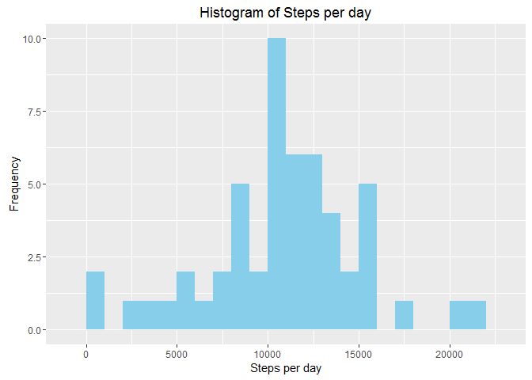
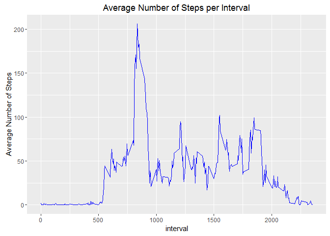
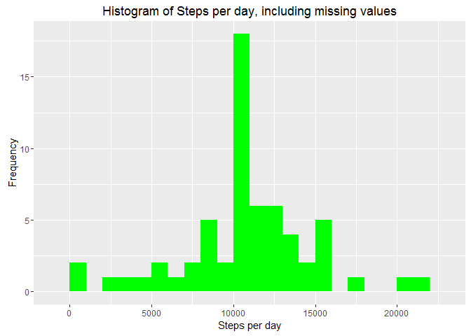

# Reproducible Research: Peer Assessment 1
Wayne Springle  
February 12, 2016  


## Load the necessary packages


```r
library(dplyr)
```

```
## Warning: package 'dplyr' was built under R version 3.2.3
```

```
## 
## Attaching package: 'dplyr'
```

```
## The following objects are masked from 'package:stats':
## 
##     filter, lag
```

```
## The following objects are masked from 'package:base':
## 
##     intersect, setdiff, setequal, union
```

```r
library(lubridate)
```

```
## Warning: package 'lubridate' was built under R version 3.2.3
```

```r
library(ggplot2)
```

```
## Warning: package 'ggplot2' was built under R version 3.2.3
```

## Loading and processing the data

Data is loaded with the read.csv() function


```r
data <- read.csv("activity.csv",header = TRUE, sep = ',', colClasses =     c("numeric", "character", "integer"))
```

Tidy the data by changing the date format with lubridate


```r
data$date <- ymd(data$date)
```

We can now proceed

## What is mean total number of steps taken per day?

1.Calculate the total number of steps taken per day.


```r
steps <- data %>%
  filter(!is.na(steps)) %>%
  group_by(date) %>%
  summarize(steps = sum(steps)) %>%
  print()
```

```
## Source: local data frame [53 x 2]
## 
##          date steps
##        (time) (dbl)
## 1  2012-10-02   126
## 2  2012-10-03 11352
## 3  2012-10-04 12116
## 4  2012-10-05 13294
## 5  2012-10-06 15420
## 6  2012-10-07 11015
## 7  2012-10-09 12811
## 8  2012-10-10  9900
## 9  2012-10-11 10304
## 10 2012-10-12 17382
## ..        ...   ...
```

2.Make a histogram of the total number of steps taken per day with ggplot.


```r
ggplot(steps, aes(x = steps)) +
  geom_histogram(fill = "Sky Blue", binwidth = 1000) +
  labs(title = "Histogram of Steps per day", x = "Steps per day", y = "Frequency")
```



3.Calculate the mean and median of the total number of steps taken per day:


```r
mean_steps <- mean(steps$steps, na.rm = TRUE)
median_steps <- median(steps$steps, na.rm = TRUE)
```


```r
mean_steps
```

```
## [1] 10766.19
```


```r
median_steps
```

```
## [1] 10765
```

Mean steps are 10766 and median steps are 10765.

## What is the average daily activity pattern?

1.Make a time series plot (i.e. type = "l") of the 5-minute interval (x-axis) and the average number of steps taken, averaged across all days (y-axis)

1a.Calculate the average number of steps taken in each 5-minute interval per day using dplyr and group by interval:


```r
interval <- data %>%
  filter(!is.na(steps)) %>%
  group_by(interval) %>%
  summarize(steps = mean(steps))
```

1b.Use ggplot for making the time series of the 5-minute interval and average steps taken:


```r
ggplot(interval, aes(x=interval, y=steps), xlab = "Interval", ylab = "Average    Number of Steps") +
 geom_line(color = "Blue")+ylab("Average Number of Steps")+ggtitle("Average Number of Steps per Interval")
```



2.Use which.max() function to find out the maximum steps, on average, across all the days:


```r
interval[which.max(interval$steps),]
```

```
## Source: local data frame [1 x 2]
## 
##   interval    steps
##      (int)    (dbl)
## 1      835 206.1698
```

The 5-minute interval which had the maximum number of steps was the 835 interval.

The maximum number of steps for a 5-minute interval was 206 steps.

## Imputing missing values

1.Calculate and report the total number of missing values in the dataset (i.e. the total number of rows with NAs) by summarizing the missing values:


```r
sum(is.na(data$steps))
```

```
## [1] 2304
```

The total number of rows with missing values(steps = 'NA') is 2304.

2.Devise a strategy for filling in all of the missing values in the dataset by using the mean/median for that day, or the mean for that 5-minute interval, etc.

3.Create a new dataset that is equal to the original dataset but with the missing data filled in.


```r
data_full <- data
nas <- is.na(data_full$steps)
avg_interval <- tapply(data_full$steps, data_full$interval, mean, na.rm=TRUE, simplify=TRUE)
data_full$steps[nas] <- avg_interval[as.character(data_full$interval[nas])]
```

Check to make sure that there are no missing values


```r
sum(is.na(data_full$steps))
```

```
## [1] 0
```

No missing values present


Make a histogram of the total number of steps taken each day and Calculate and report the mean and median total number of steps taken per day. Do these values differ from the estimates from the first part of the assignment? What is the impact of imputing missing data on the estimates of the total daily number of steps?

4.Calculate the number of steps taken in each 5-minute interval per day using dplyr and group by interval. Use ggplot for making the histogram:


```r
steps_full <- data_full %>%
  filter(!is.na(steps)) %>%
  group_by(date) %>%
  summarize(steps = sum(steps)) %>%
  print()
```

```
## Source: local data frame [61 x 2]
## 
##          date    steps
##        (time)    (dbl)
## 1  2012-10-01 10766.19
## 2  2012-10-02   126.00
## 3  2012-10-03 11352.00
## 4  2012-10-04 12116.00
## 5  2012-10-05 13294.00
## 6  2012-10-06 15420.00
## 7  2012-10-07 11015.00
## 8  2012-10-08 10766.19
## 9  2012-10-09 12811.00
## 10 2012-10-10  9900.00
## ..        ...      ...
```

We now plot the histogram:


```r
ggplot(steps_full, aes(x = steps)) +
  geom_histogram(fill = "Green", binwidth = 1000) +
  labs(title = "Histogram of Steps per day, including missing values", x = "Steps per day", y = "Frequency")
```



Calculate the mean and median steps with the filled in values:


```r
mean_steps_full <- mean(steps_full$steps, na.rm = TRUE)
median_steps_full <- median(steps_full$steps, na.rm = TRUE)
```


```r
mean_steps_full
```

```
## [1] 10766.19
```


```r
median_steps_full
```

```
## [1] 10766.19
```


After puting in the missing data with the average number of steps in the same 5-min interval, we find that both the mean and the median are equal to the same value: 10766.

## Are there differences in activity patterns between weekdays and weekends?

1.Create a new factor variable in the dataset with two levels - "weekday" and "weekend" indicating whether a given date is a weekday or weekend day.


```r
data_full <- mutate(data_full, weektype = ifelse(weekdays(data_full$date) == "Saturday" | weekdays(data_full$date) == "Sunday", "weekend", "weekday"))
data_full$weektype <- as.factor(data_full$weektype)
```

2.Calculate the average steps in the 5-minute interval and use ggplot for making the time series of the 5-minute interval for weekday and weekend, and compare the average steps.


```r
interval_full <- data_full %>%
  group_by(interval, weektype) %>%
  summarise(steps = mean(steps))
s <- ggplot(interval_full, aes(x=interval, y=steps, color = weektype)) +
  geom_line() +
  facet_wrap(~weektype, ncol = 1, nrow=2)
print(s)
```


Yes, the step activity trends are different based on whether the day occurs on a weekend or not. This may be due to people having an increased opportunity for activity beyond normal work hours for those who work during the week.


